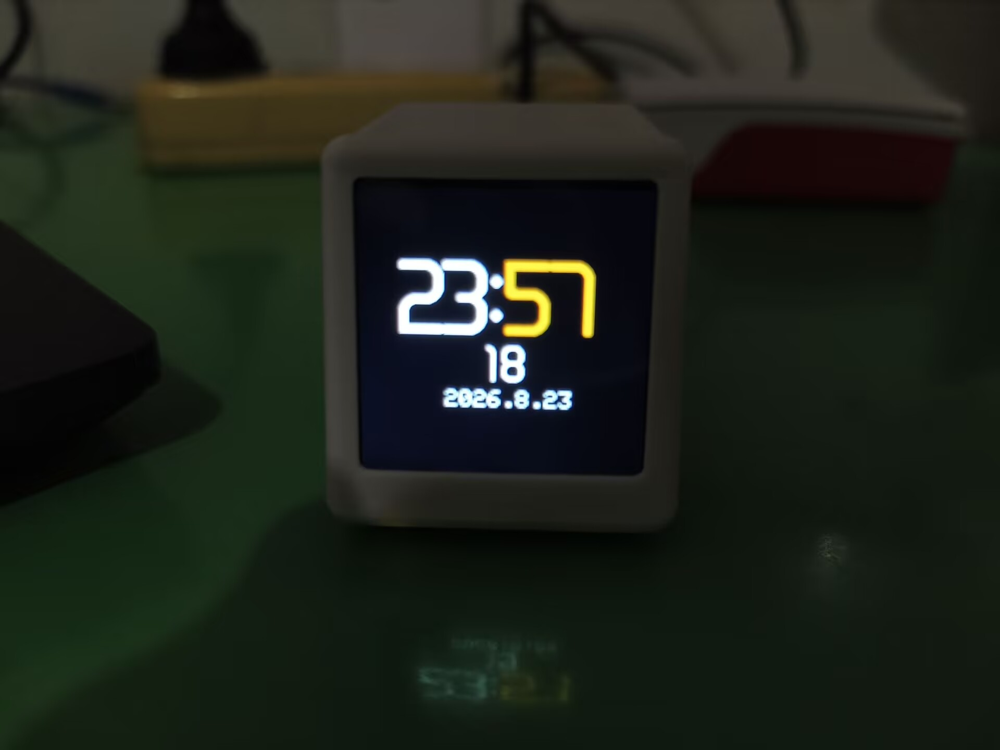
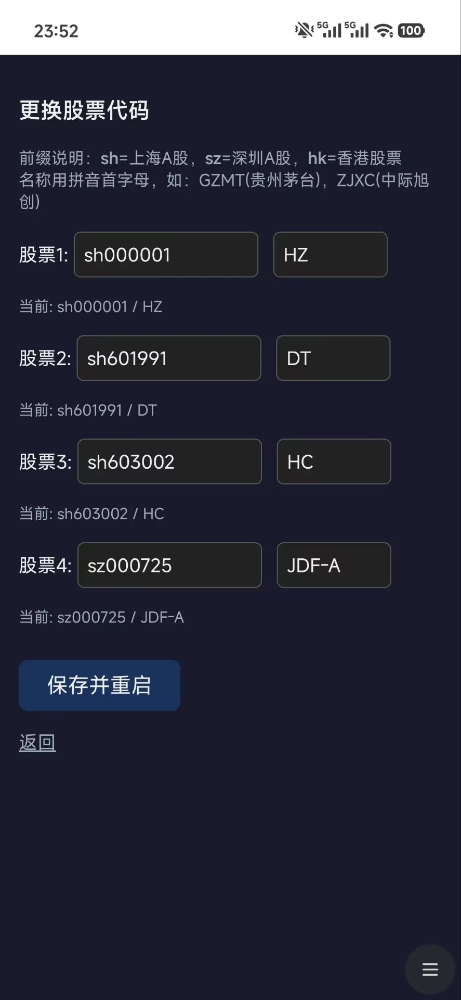
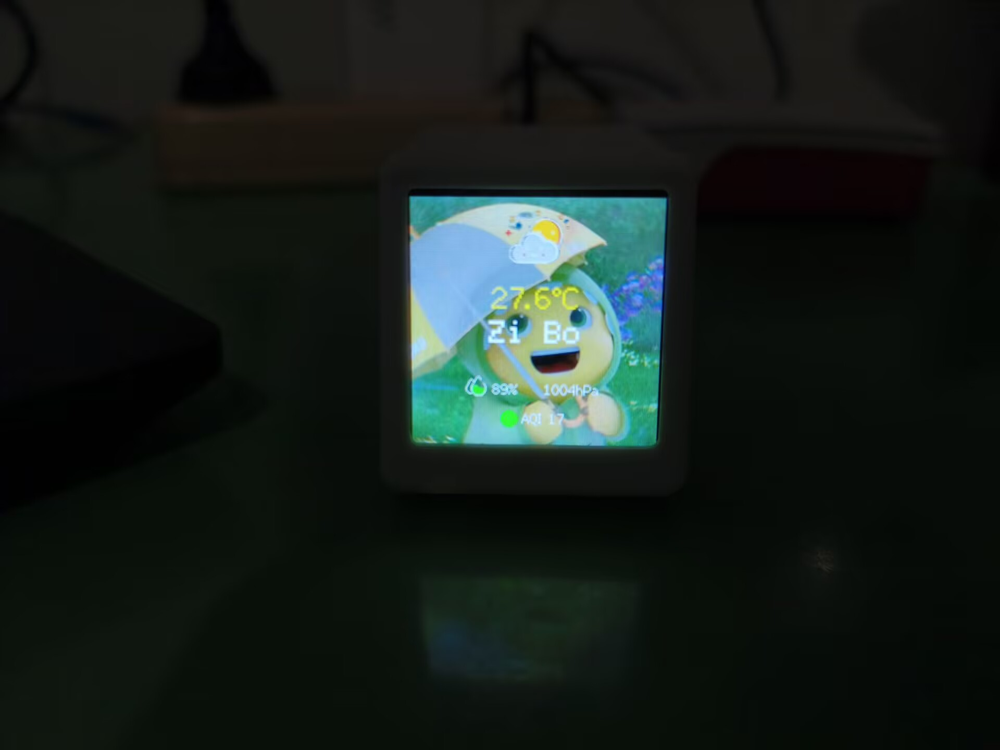
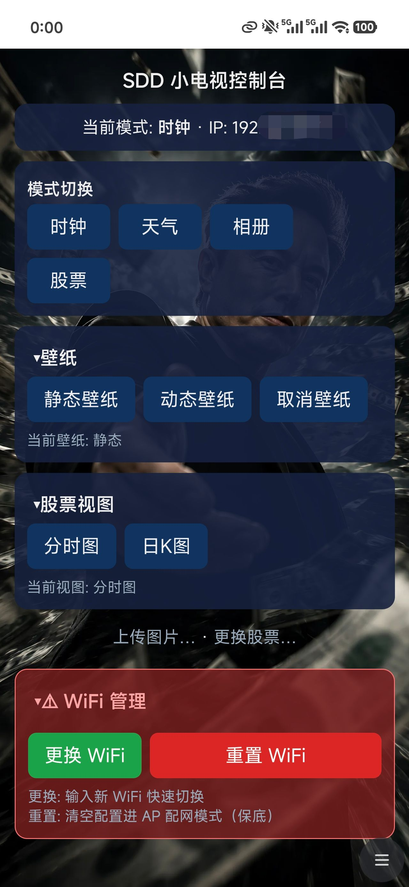

# stock-tv — 桌面小电视(ESP32-C3)A股/基金实时行情屏显

深度支持**多股/基金轮播+自定义昵称**行情屏。
数据链路:`腾讯行情 + 天天基金 → PC daemon(JSON) → 设备轮播显示`

```
stock-tv/
├── firmware/        # PlatformIO 固件工程 (ESP32-C3 + TFT_eSPI)
│   ├── platformio.ini      # 含全部引脚配置,无需改库文件
│   ├── include/config.h    # ★ WiFi / daemon地址 / 自选股 在这里改
│   └── src/main.cpp
└── daemon/          # PC端数据聚合服务 (Flask, 端口8899)
    └── app.py
```

## 第零步:确定硬件引脚(依据 C3天气预报电路图.pdf,已写入 platformio.ini)

| 信号 | GPIO | 备注 |
|---|---|---|
| SCL | 3 | SPI时钟 |
| SDA | 4 | SPI MOSI |
| DC | 2 | |
| RST | 5 | |
| BL | 1 | AO3401 P-MOS,**低电平点亮** |
| CS | — | 屏端接地,固定选中 |
| USB | 18/19 | 原生USB,Type-C直刷 |

## 第一步:跑起数据端 daemon

```bash
cd daemon
pip install -r requirements.txt
python app.py
# 自测: 浏览器开 http://127.0.0.1:8899/quote?symbol=sh600519
```

记下本机局域网IP(`ipconfig` 看 IPv4),填进 `firmware/include/config.h` 的 `WEBHOOK_BASE`。
注意:Windows 防火墙需放行 8899 端口(首次运行弹窗选"允许")。

## 第二步:编译烧录固件

```bash
pip install platformio          # 首次
cd firmware
# 先改 include/config.h: WiFi账号密码、WEBHOOK_BASE、自选股列表
pio run                         # 编译
pio run -t upload               # 烧录(自动找COM口)
pio device monitor              # 看串口日志(115200)
```

## 疑难排查(按命中率排序)

| 现象 | 处理 |
|---|---|
| 花屏/无显示 | platformio.ini 打开 `-DTFT_SPI_MODE=SPI_MODE3`(CS接地批次差异) |
| 颜色反了 | 去掉/添加 `-DTFT_INVERSION_ON=1` |
| 画面偏移约80行 | 打开 `-DCGRAM_OFFSET=1` |
| 红蓝互换 | ST7789 RGB顺序差异,tft.init后加 `tft.invertDisplay()` 前先试上一条 |
| 显示方向不对 | main.cpp 里 `tft.setRotation(0)` 改 0-3 |
| NO DATA | 检查 daemon 是否运行、防火墙、WEBHOOK_BASE 的IP |
| 烧录失败 | 按住BOOT(GPIO9接地)重新上电再烧;或用CH340G接UART焊盘救砖 |

## 符号规则

- 股票/指数:`sh600519` `sz000001` `sh000001`(上证指数)
- 场外基金:`f005827`(前缀f,盘中显示估值/估值涨幅)

## 路线图

- [ ] v0.1 多股轮播 + 现价/涨跌幅/分时走势 + 轮播指示点(本版)
- [ ] v0.2 AP配网(免改代码配WiFi)+ Web页管理自选股
- [ ] v0.3 中文字库(显示股票中文名)
- [ ] v0.4 到价提醒(满屏变色闪烁)+ 夜间自动降亮度

## 实物展示
### 默认时钟界面


### 自定义时钟


### 图片显示功能


### 股票行情界面


### 股票设置页面


### 天气界面


### Web配置+总控台

