**License: Apache‑2.0**
> 主仓库[GitHub](https://github.com/LY-1157799217/Visual-desktop-TV-decoration)
> 国内镜像访问：[Gitee](https://gitee.com/LY115LY/Visual-desktop-TV-decoration)
> 两个仓库保持同步更新，国内访问建议使用Gitee镜像。

> 基于ESP32‑C3的桌面信息TV摆件，内网Web控制器；实现自定义静态/动态壁纸、实时时钟、城市天气、A股多股票分时/K线轮播。
> **设备自身通过 WiFi 直连**腾讯行情、中国天气网等第三方公开数据接口，**不需要额外的 PC、树莓派或服务器**；全部配置在局域网网页上完成。
> 设备配置和自定义图片默认不上传至项目作者的服务器。

> **📌 该选哪个版本？**
> - **手头没有树莓派** → 用本版（**无Pi版**）：烧录后上电即可用。
> - **有树莓派，想让它当常开中控**（企业微信远程控制小电视、涨跌停/异动推送、MQTT 信息中转）→ 选 **Pi Hub 版**：[GitHub](https://github.com/LY-1157799217/mqtt-edge-hub) ｜ [Gitee](https://gitee.com/LY115LY/mqtt-edge-hub)。
> - 想在无Pi版基础上自己加服务也完全可以 —— 源码全开，随意改。
>
> 两版**共用同一套显示端硬件与外壳**，区别只在"数据从哪来"：
> 本版**设备直连上游**，不需要任何常开主机；Pi Hub 版**多一台树莓派**，
> 换来集中缓存、企业微信推送与远程控制。详细对照见 Pi Hub 版 README 的「📊 与无Pi版的区别」。

# stock-tv — 桌面小电视(ESP32-C3)A股/基金实时行情屏显
## ✨项目亮点
1. ESP32‑C3驱动TFT屏幕，支持静态图片、轮动壁纸渲染
2. **设备直连公开数据接口**，免 PC、免服务器、免常开主机；配网、切模式、改自选股全部在网页上完成
3. Web网页控制器，浏览器完成设备全部配置，支持网页背景自定义、快捷WIFI配置、一键重置
4. A股/基金多标的轮播，分时图、日K图解析渲染，支持自定义股票别名
5. 根据时钟，可选自动亮度调节或手动锁定亮度，更贴合人眼视觉习惯
6. **天气城市自定义**：3000+城市搜索库，支持拼音名称自定义，10个常用城市快捷切换
7. **SPIFFS自动清理**：启动时自动删除无用文件，保持存储空间宽松，存储监控一目了然
8. **取数与阻塞优化**：把"一轮 loop 内多次取数"改为硬性互斥（一轮最多 1 次），配合分时/日K 的分级刷新周期，实测把阻塞占空比从 ~45% 降到 ~25%；网页控制台首页加载从 5.2 秒降到 2.3 秒
9. **AI‑Native全域人机协同开发**：项目基于Claude Code协同完成，AI辅助架构设计、代码编写、排错调试、文档撰写，**人主导需求决策、BUG排查定位、硬件实物验证、业务逻辑把关**
10. 完整硬件引脚说明、部署文档；**主工程为Arduino IDE完整全功能版本**，附带PlatformIO工程用于底层模块调试
11. 设备端仅访问上述第三方公开接口；用户配置和自定义图片不上传至项目作者服务器

## 🧾硬件BOM清单
- 主控：ESP32‑C3
- 屏幕：SPI接口TFT彩屏
- 供电：Type‑C USB供电

> **不需要**树莓派、PC 或任何常开主机 —— 一块 ESP32‑C3 + 一个 USB 充电头即可独立运行。

## 🤖开发模式说明
本项目采用 AI‑Native 人机协同开发工作流：
- 使用 Claude Code 承担代码生成、排错调试、文档初稿、工程结构梳理；
- 人负责按需定义、BUG排查定位、硬件实物验证、业务逻辑取舍、代码审查、功能实测；
- AI作为开发助手，**核心业务逻辑、硬件适配、系统架构均由人主导把控**。

深度支持**多股/基金轮播+自定义昵称**行情屏。
数据链路:`腾讯行情 + 中国天气网 → 设备直连(WiFi) → 屏幕轮播显示`
注：本项目仅供展示与学习，不构成投资或气象决策依据！
```
Visual-desktop-TV-decoration/
├── arduino/
│   ├── integrated/     # ★ 完整全功能主工程（Arduino IDE，推荐使用）
│   ├── clock/          # 单模块示例：时钟
│   ├── weather/        # 单模块示例：天气
│   ├── photo/          # 单模块示例：相册
│   ├── wallpaper_clock/# 单模块示例：壁纸+时钟
│   └── stocktv/        # 单模块示例：股票（早期版本，走 PC daemon）
├── firmware/           # PlatformIO 底层调试工程（仅引脚/背光等单元验证，不含完整业务）
├── daemon/             # ⚠️ 早期版本的 PC 端中转服务(Flask, 8899)，仅 arduino/stocktv 使用
└── assets/             # README 展示图片
```

> ⚠️ **`daemon/` 是历史模块**：项目早期（v0.1）由 PC 上的 Flask 服务做数据中转。
> **当前主工程 `arduino/integrated` 已改为设备直连，不需要运行 daemon，也不需要 PC。**
> 该目录仅为保留早期单模块示例 `arduino/stocktv` 的可运行性而存在。

## 第零步:确定硬件引脚(可参考ESP32‑C3公开电路图,具体以本仓库表格与platformio.ini 为准)

| 信号 | GPIO | 备注 |
|---|---|---|
| SCL | 3 | SPI时钟 |
| SDA | 4 | SPI MOSI |
| DC | 2 | |
| RST | 5 | |
| BL | 1 | AO3401 P-MOS,**低电平点亮** |
| CS | — | 屏端接地,固定选中 |
| USB | 18/19 | 原生USB,Type-C直刷 |

## 第一步:编译烧录主工程

**`arduino/integrated/` 是完整全功能主工程，推荐用 Arduino IDE 编译烧录。**

```bash
# 1) 用 Arduino IDE 打开:
#    arduino/integrated/integrated.ino

# 2) 开发板管理器安装 esp32 (Espressif)，选择:
#    ESP32C3 Dev Module
#    分区方案: No OTA (2MB APP / 2MB SPIFFS)
#    USB CDC On Boot: Enabled

# 3) TFT_eSPI 库需要用本仓库提供的配置覆盖:
#    把根目录的 TFT_eSPI_Setup.h 覆盖到库目录下的 User_Setup.h
#    （引脚、驱动、SPI模式都在里面）

# 4) 上传。首次烧录后设备会进入配网模式
```

⚠️ **无需修改任何代码**：WiFi 账号密码在设备的配网页面上填，自选股、城市、亮度等全部在网页控制台上改。

💡补充：
- `firmware/` 目录是 **PlatformIO 底层调试工程**，仅用于引脚/背光等单元验证，**不含完整业务功能**，日常使用不需要它
- 如需切换 WiFi 或设备换了网络：见下方"疑难排查"里的「更换 WiFi」

## 第二步:配网与网页控制台

设备首次上电（或重置后）会开一个热点 **`SDD小电视`**：

1. 手机/电脑连该热点 → 打开 `192.168.4.1`
2. 填写你家 WiFi 的账号密码 → 保存
3. 设备重启后连上你的 WiFi，用串口日志里的 `WebServer: http://<IP>` 地址即可打开控制台

**控制台能做的事：**

| 分组 | 能改什么 |
|---|---|
| 模式切换 | 时钟 / 天气 / 相册 / 股票 四模式一键切换 |
| 壁纸 | 静态壁纸选择、动态壁纸、关闭壁纸 |
| 股票视图 | 分时图 / 日K图 |
| 股票配置 | 自选股代码、显示别名（最多 4 只） |
| 屏幕亮度 | 手动 0–100%，或开启按时段自动调节 |
| 天气城市 | 3000+ 城市搜索、常用城市一键切换 |
| 刷新间隔 | 股票数据刷新周期（见下） |
| SPIFFS | 存储占用查看、文件列表 |
| WiFi 管理 | 更换 WiFi / 重置 WiFi（进 AP 配网模式） |

### 🆕 网页快捷指令（可直接在地址栏用）

| 路由 | 作用 |
|---|---|
| `/set?refresh=N` | **设置股票刷新间隔（5~600 秒）**。N 秒意味着"每只股票 N/4 秒取一次数据"。<br>默认 60 秒。调小会更实时，但会增加设备网络负担与耗电 |
| `/set?mode=N` | 切换模式（0=时钟 1=天气 2=相册 3=股票） |
| `/set?brightness=N` | 设置亮度（0–100） |
| `/status` | **只读** JSON：固件版本、IP、运行时长、剩余堆、最大连续块、RSSI、当前模式等 |

> ⚠️ **`/status` 仅用于人工排障，请勿轮询。** 每一次请求都会占用设备时间；
> 高频轮询（例如 1 秒 1 次）会显著拖慢设备、影响屏幕刷新。
> 需要长期监控请用串口日志，不要在它上面跑定时任务。

## 疑难排查(按命中率排序)

| 现象 | 处理 |
|---|---|
| 花屏/无显示 | 确认 `TFT_eSPI_Setup.h` 已覆盖库里的 `User_Setup.h`；再试 `-DTFT_SPI_MODE=SPI_MODE3`(CS接地批次差异) |
| 颜色反了 | 去掉/添加 `-DTFT_INVERSION_ON=1` |
| 画面偏移约80行 | 打开 `-DCGRAM_OFFSET=1` |
| 红蓝互换 | ST7789 RGB顺序差异,`tft.init`后加 `tft.invertDisplay()` 前先试上一条 |
| 显示方向不对 | `integrated.ino` 里 `tft.setRotation(0)` 改 0-3 |
| **行情不更新 / 显示 `--`** | ① 设备是否已连上 WiFi（看串口 `WebServer: http://...`）<br>② 路由器能否访问外网<br>③ 股票代码格式是否正确（见下方"符号规则"） |
| **网页能开但很久才出来** | 正常现象：这台设备上一次网络往返本身就要 1 秒以上（开 `CMP_BUILD 1` 可见 `[T]` 日志）。<br>**不要在页面没出来时反复点击** —— 会触发浏览器的连接取消，反而更容易报错 |
| **点快了偶尔弹"拒绝了我们的连接请求"** | 设备正忙时的正常表现。控制台已有防抖保护，正常使用不会遇到 |
| **切换 WiFi / 换了路由器** | 控制台底部「⚠ WiFi 管理」→「更换 WiFi」；实在连不上就「重置 WiFi」进 AP 配网模式 |
| 烧录失败 | 按住BOOT(GPIO9接地)重新上电再烧;或用CH340G接UART焊盘救砖 |

### 🔧 要提交 Issue / 想自己排查？先打开诊断构建

主工程源码顶部有一个构建开关（**是源码里的一行，不是网页按钮** —— 改完要重新编译烧录）：

```c
#define CMP_BUILD 0    // 0 = 发布构建（默认，正常使用）  1 = 诊断构建
```

改成 `1` 重新烧录后，串口会多出两类信息：

| 输出 | 内容 |
|---|---|
| `[T] <类型> <代码> <ms>ms ok=<0\|1>` | **每一笔网络取数花了多久、成功与否** —— 定位"卡顿/响应慢"最直接 |
| `[HB] ...` | 每 60 秒一条：堆余量、最大连续块、RSSI、单轮最长耗时 |

**提 Issue 时把串口日志贴上来，基本能直接定位问题。** 两种构建**业务逻辑完全相同**，只差这些诊断输出。

> 💡 想长期观察内存是否稳定（比如怀疑有泄漏），用 `CMP_BUILD 1` 跑几小时，看 `[HB]` 里的
> `free` 和 `maxAlloc` 两列有没有持续下降即可。

## 符号规则

- 股票/指数:`sh600519` `sz000001` `sh000001`(上证指数)
- 场外基金:`f005827`(前缀f,官方净值及日涨幅，盘中可作参考)
💡注意：填写时确保股票代码长度无误，避免出错或乱码

## 数据接口说明

本项目使用以下免费公开API获取数据（**均由设备自身直接访问**）：

### 股票行情数据
- **腾讯财经API** (`http://qt.gtimg.cn/q=`)
  - 实时行情
  - 完全免费，无需注册
  - 支持A股、指数
- **腾讯分时/日K API** (`https://web.ifzq.gtimg.cn/`)
  - 分时走势、日K线数据

### 天气数据
- **中国天气网API** (`http://d1.weather.com.cn/weather_index/`)
  - 实时温度、湿度、气压、AQI
  - 官方数据源（中国气象局）
  - 完全免费，无需注册
  - 10分钟自动刷新
  - 支持3000+中国城市（使用9位城市代码）
  - **城市名显示限制**：屏幕最多显示8个英文字母（超出会被截断）

**注意**：所有接口均为第三方公开服务，数据仅供展示学习，不构成任何投资或气象决策依据。
设备**不会**将你的配置或自定义图片上传到项目作者的服务器。

## 路线图

- [x] v0.1 多股轮播 + 现价/涨跌幅/分时走势 + 轮播指示点
- [x] v0.2 AP配网(免改代码配WiFi)+ Web页管理自选股
- [x] v0.3 背光亮度自由调节 + 自动亮度调节
- [x] v0.4 取数与阻塞优化、网页控制台体验优化、诊断开关
- [ ] v0.5 中文字库(因 ESP32-C3 闪存限制暂不实现)

## 实物展示
### Web配置+总控台
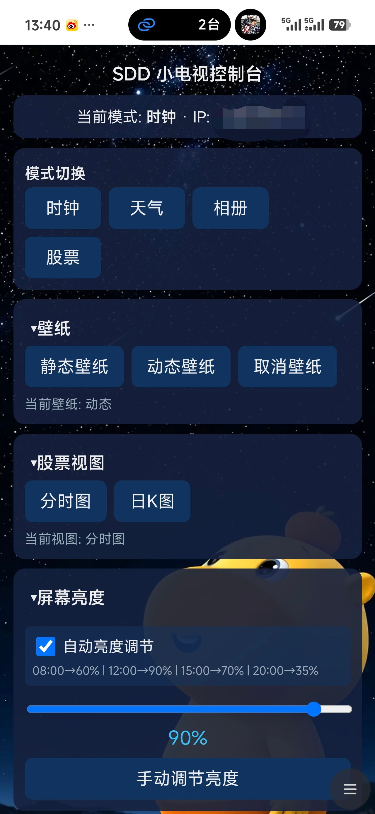

### Web总控台补充
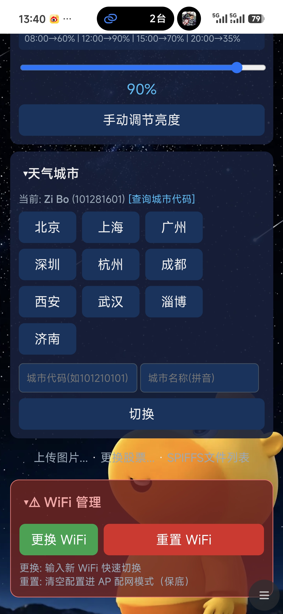

### 自定义时钟显示
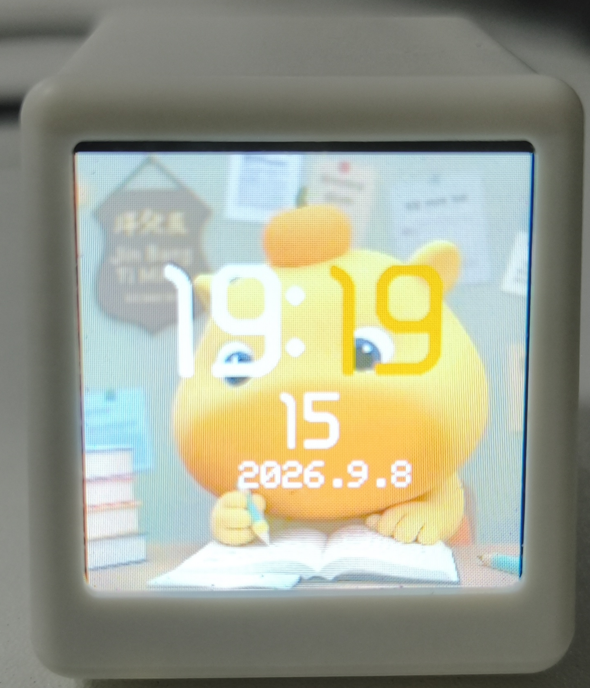

### 自定义天气显示
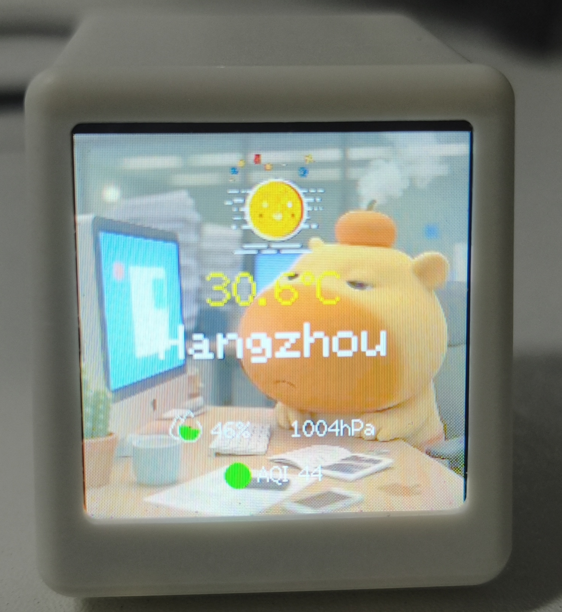

### 自定义图片展示
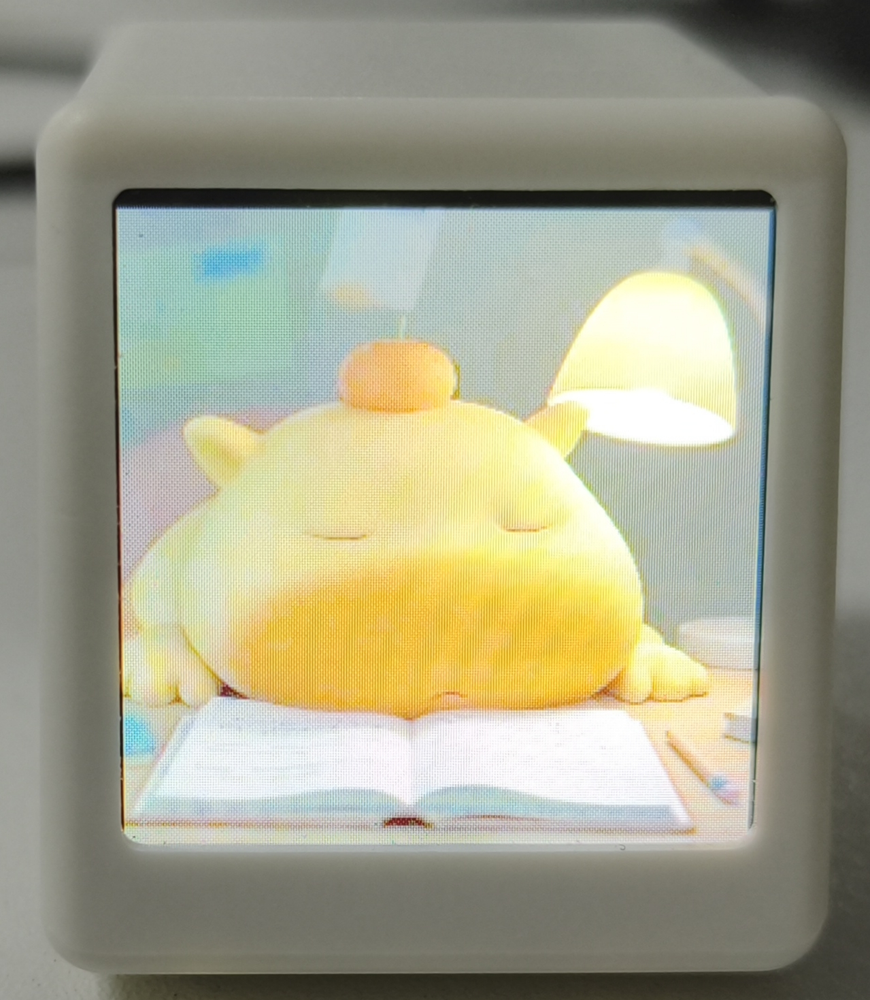

### 股票分时图
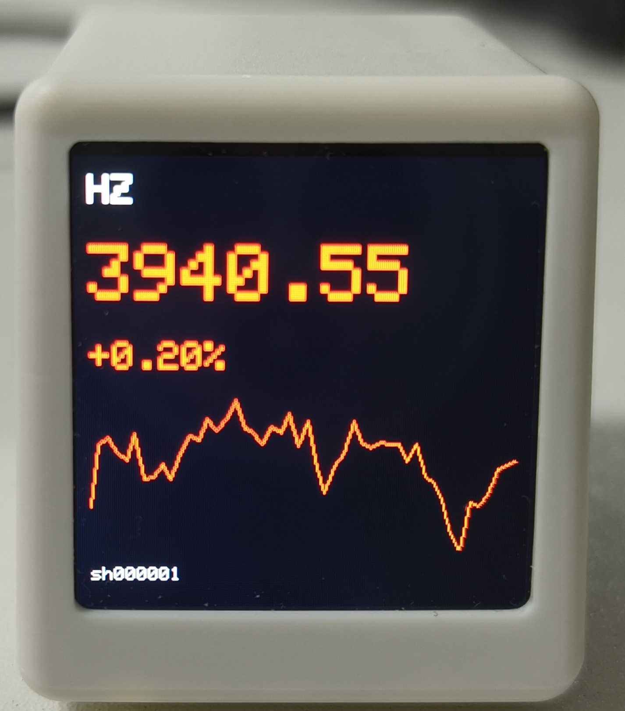

### 股票日K线图
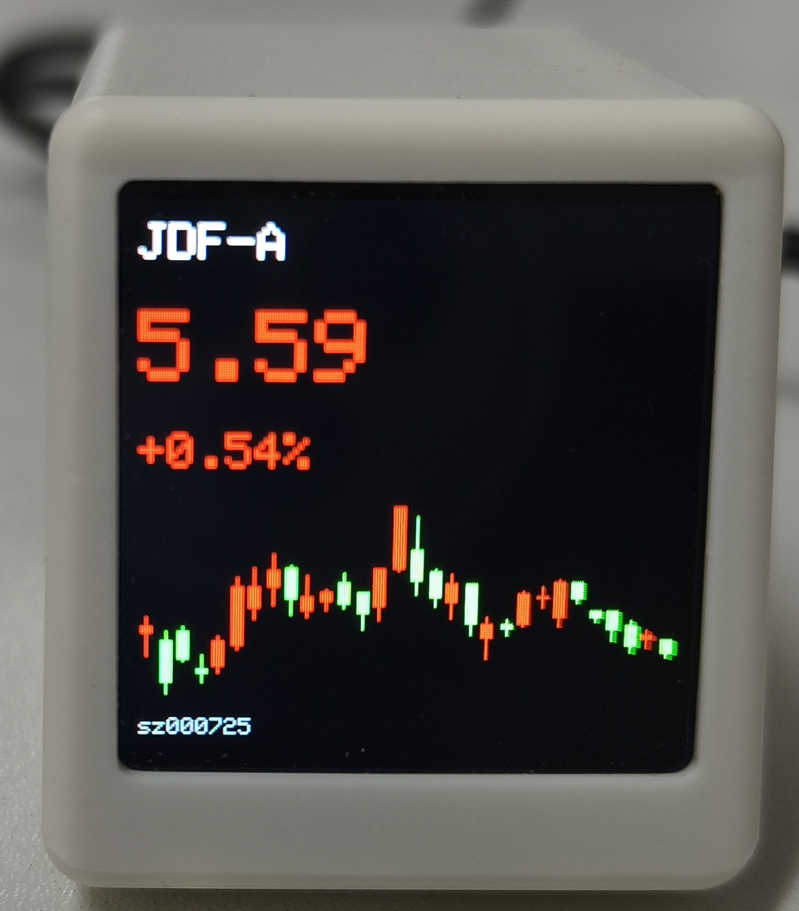

### 股票设置
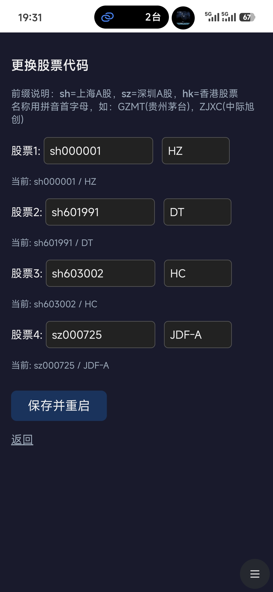

### 城市代码查询
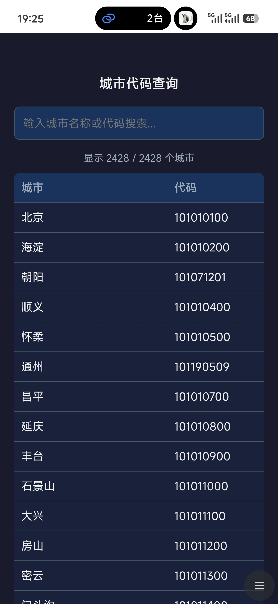

### 图片+JSON设置
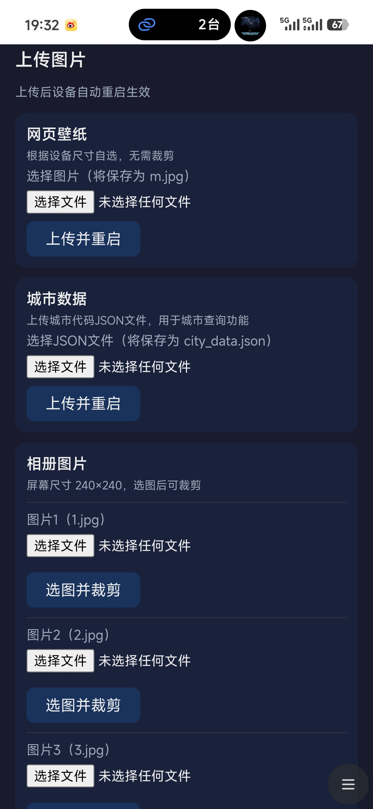

### SPIFFS存储信息
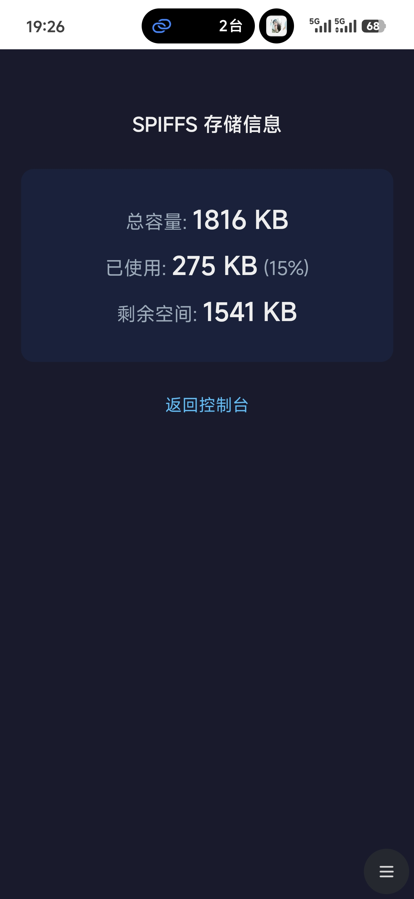
