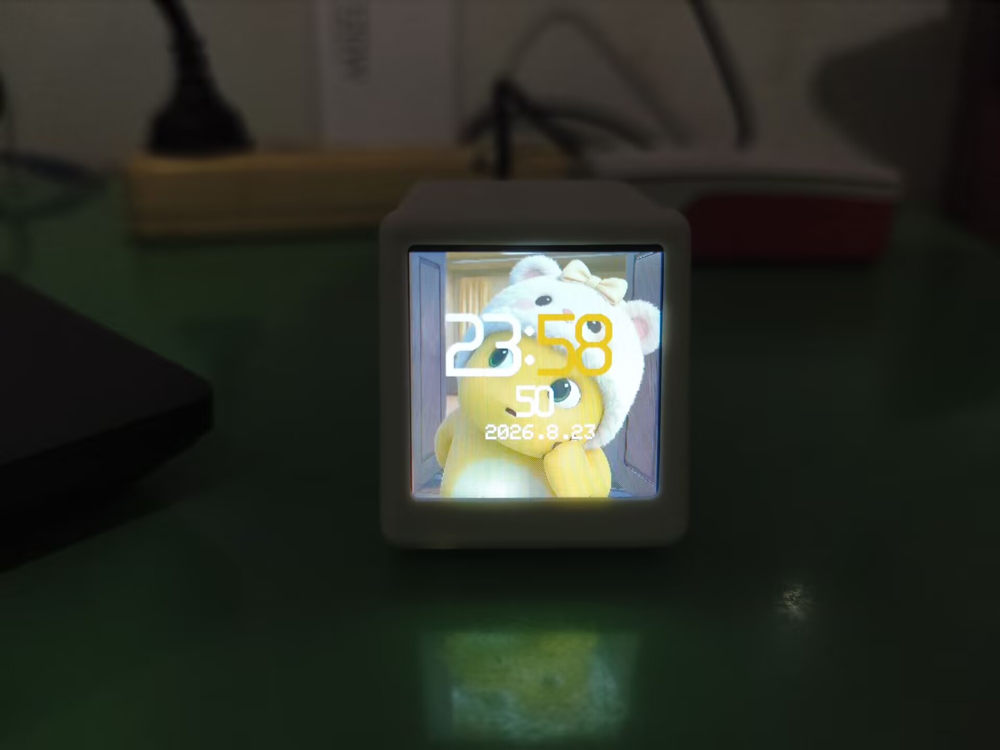
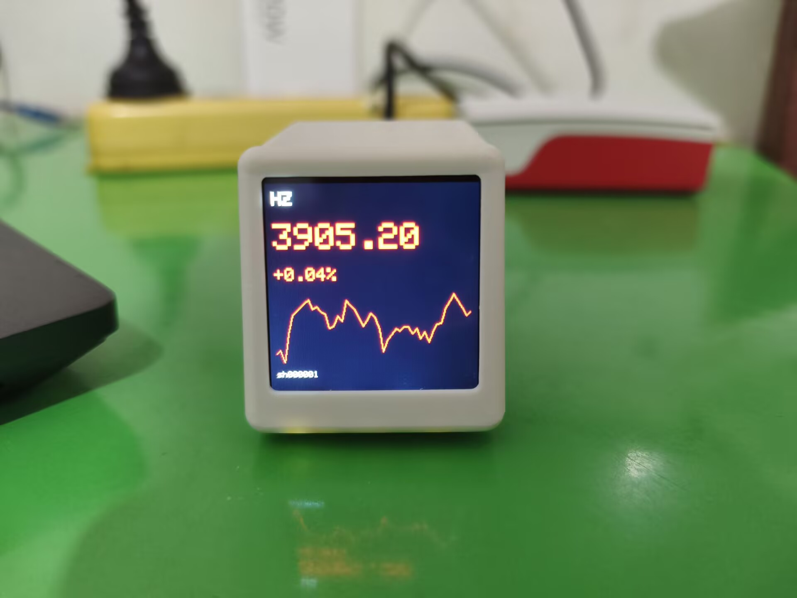

**License: Apache‑2.0**
> 主仓库[GitHub](https://github.com/LY-1157799217/Visual-desktop-TV-decoration)
> 国内镜像访问：[Gitee](https://gitee.com/LY115LY/Visual-desktop-TV-decoration)
> 两个仓库保持同步更新，国内访问建议使用Gitee镜像。

> 基于ESP32‑C3的桌面信息TV摆件，内网Web控制器；实现自定义静态/动态壁纸、实时时钟、城市天气、A股多股票分时/K线轮播。ESP32 设备只与局域网内的 PC daemon 通信；daemon 会访问腾讯行情和东方财富等第三方公开数据接口。设备配置和自定义图片默认不上传至项目作者的服务器。

# stock-tv — 桌面小电视(ESP32-C3)A股/基金实时行情屏显
## ✨项目亮点
1. ESP32‑C3驱动TFT屏幕，支持静态图片、轮动壁纸渲染
2. Python‑Flask实现PC端daemon服务，内网JSON协议做数据中转
3. Web网页控制器，浏览器完成设备全部配置，支持网页背景自定义、快捷WIFI配置、一键重置
4. A股/基金多标的轮播，分时图、日K图解析渲染，支持自定义股票别名
5. **AI‑Native全域人机协同开发**：项目基于Claude Code协同完成，AI辅助架构设计、代码编写、排错调试、文档撰写，**人主导需求决策、BUG排查定位、硬件实物验证、业务逻辑把关**
6. 完整硬件引脚说明、部署文档；**主工程为Arduino IDE完整全功能版本**，附带PlatformIO工程用于底层模块调试。
7. 设备端仅与局域网 daemon 通信；用户配置和自定义图片不上传至项目作者服务器。

## 🧾硬件BOM清单
- 主控：ESP32‑C3
- 屏幕：SPI接口TFT彩屏
- 供电：Type‑C USB供电

## 🤖开发模式说明
本项目采用 AI‑Native 人机协同开发工作流：
- 使用 Claude Code 承担代码生成、排错调试、文档初稿、工程结构梳理；
- 人负责按需定义、BUG排查定位、硬件实物验证、业务逻辑取舍、代码审查、功能实测；
- AI作为开发助手，**核心业务逻辑、硬件适配、系统架构均由人主导把控**。

深度支持**多股/基金轮播+自定义昵称**行情屏。
数据链路:`腾讯行情 + 天天基金 → PC daemon(JSON) → 设备轮播显示`
注：本项目仅供展示与学习，不构成投资或气象决策依据
```
stock-tv/
├── arduino/         # Arduino IDE 完整全功能主工程
├── firmware/        # PlatformIO 底层固件工程 (ESP32-C3 + TFT_eSPI)
│   ├── platformio.ini      # 含全部引脚配置,无需改库文件
│   ├── include/config.h    # ★ WiFi / daemon地址 / 自选股 在这里改
│   └── src/main.cpp
└── daemon/          # PC端数据聚合服务 (Flask, 端口8899)
    └── app.py
```

## 第零步:确定硬件引脚(可参考ESP32‑C3公开电路图,具体以本仓库表格与platformio.ini 为准)

| 信号 | GPIO | 备注 |
|---|---|---|
| SCL | 3 | SPI时钟 |
| SDA | 4 | SPI MOSI |
| DC | 2 | |
| RST | 5 | |
| BL | 1 | AO3401 P-MOS,**低电平点亮** |
| CS | — | 屏端接地,固定选中 |
| USB | 18/19 | 原生USB,Type-C直刷 |

## 第一步:跑起数据端 daemon

```bash
cd daemon
pip install -r requirements.txt
python app.py
# 自测: 浏览器开 http://127.0.0.1:8899/quote?symbol=sh600519
```

记下本机局域网IP(`ipconfig` 看 IPv4),填进 `firmware/include/config.h` 的 `WEBHOOK_BASE`。
注意:Windows 防火墙需放行 8899 端口(首次运行弹窗选"允许")。

💡提示：
- `arduino/`目录：**完整全功能主工程，推荐使用Arduino IDE编译烧录**
- `firmware/`目录：PlatformIO工程，仅用于底层模块、背光等单元调试，不含全部业务功能
⚠️下面为firmware目录PlatformIO底层调试版本编译流程；**完整业务功能请打开 arduino目录 使用Arduino IDE编译烧录**

## 第二步:编译烧录固件

```bash
pip install platformio          # 首次
cd firmware
# 先改 include/config.h 中的 WiFi 账号密码；其余行情配置由完整 Arduino 主工程使用
pio run                         # 编译
pio run -t upload               # 烧录(自动找COM口)
pio device monitor              # 看串口日志(115200)
```

## 疑难排查(按命中率排序)

| 现象 | 处理 |
|---|---|
| 花屏/无显示 | platformio.ini 打开 `-DTFT_SPI_MODE=SPI_MODE3`(CS接地批次差异) |
| 颜色反了 | 去掉/添加 `-DTFT_INVERSION_ON=1` |
| 画面偏移约80行 | 打开 `-DCGRAM_OFFSET=1` |
| 红蓝互换 | ST7789 RGB顺序差异,tft.init后加 `tft.invertDisplay()` 前先试上一条 |
| 显示方向不对 | main.cpp 里 `tft.setRotation(0)` 改 0-3 |
| NO DATA | 检查 daemon 是否运行、防火墙、WEBHOOK_BASE 的IP |
| 烧录失败 | 按住BOOT(GPIO9接地)重新上电再烧;或用CH340G接UART焊盘救砖 |

## 符号规则

- 股票/指数:`sh600519` `sz000001` `sh000001`(上证指数)
- 场外基金:`f005827`(前缀f,官方净值及日涨幅，盘中可作参考)
💡注意：填写时确保股票代码长度无误，避免出错或乱码

## 路线图

- [x] v0.1 多股轮播 + 现价/涨跌幅/分时走势 + 轮播指示点(本版)
- [x] v0.2 AP配网(免改代码配WiFi)+ Web页管理自选股
- [ ] v0.3 中文字库(因 ESP32-C3 闪存限制暂不实现)
- [ ] v0.4 到价提醒(满屏变色闪烁)+ 夜间自动降亮度

## 实物展示
### 默认时钟界面


### 自定义时钟


### 图片显示功能


### 股票行情界面


### 股票设置页面


### 天气界面


### Web配置+总控台

